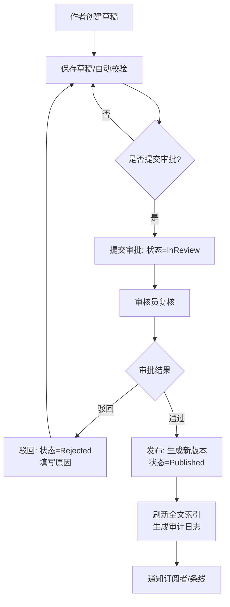
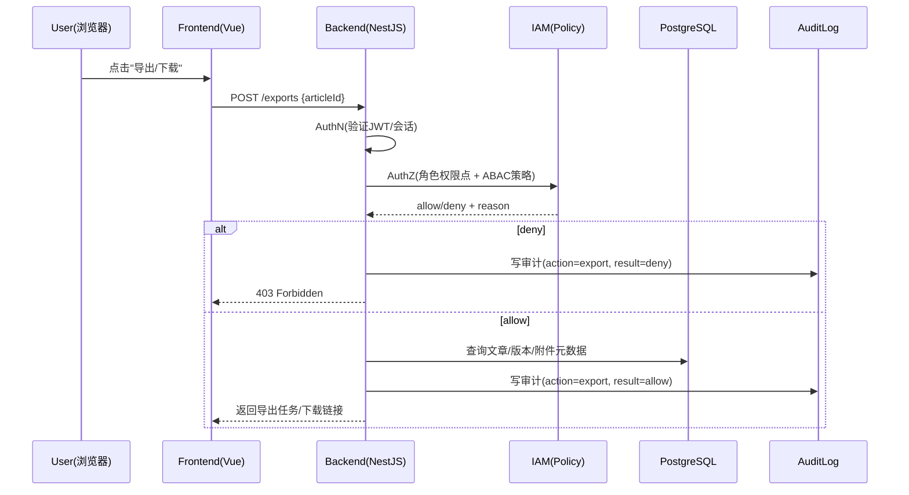
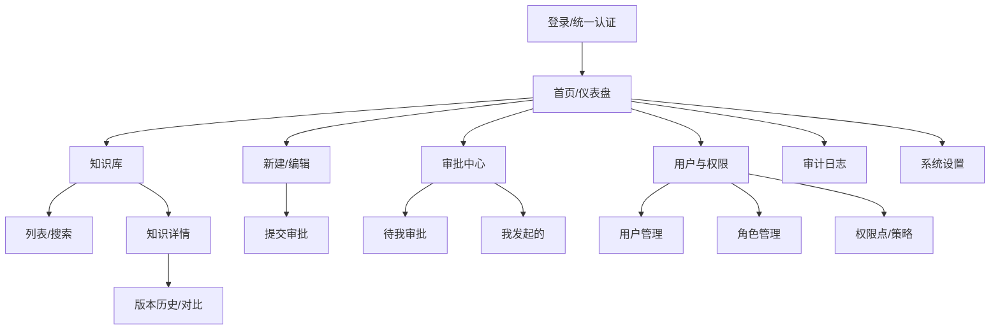

# 银行知识库系统完整交付包（Vue3 + NestJS + PostgreSQL）

## Executive summary

本报告给出一个可从 0 启动并落地的“银行知识库系统”完整交付包：需求方案（PRD）、信息架构与设计规范、6 张高保真 UI（PNG）、数据库全表设计（含约束/索引/示例）、开发交付清单（API/前端组件/部署/测试/运维），并将安全合规按银行级要求（最小权限、审计、加密、脱敏、日志不可篡改）做成可执行的工程方案。整体安全设计以 entity["organization","OWASP","application security org"] 的 Top 10/ASVS 与 Cheat Sheet 系列为应用层基线，结合 entity["organization","NIST","us standards institute"] 的控制与工程实践（如 SP 800-53、800-92、800-52、800-218 等）形成“可验收”的合规控制清单。citeturn0search1turn9view0turn1search3turn0search10turn4view0turn2search1turn2search0

交付物已生成并打包为可下载 ZIP（含 PRD.md / DESIGN.md / UI PNG / DB schema.sql / API endpoints.md / prompts.md）：  
[下载完整交付包 ZIP](sandbox:/mnt/data/bank-kb-delivery-pack.zip)

---

## 范围、假设与交付物清单

本交付包面向“中等规模”内部系统：知识条目约 100k、峰值约 200 QPS；部署环境无特定约束；前端栈 Vue3 + TypeScript + Vite + Pinia + Axios + Element Plus；后端为 Node.js + TypeScript + NestJS + PostgreSQL。全文检索默认使用 PostgreSQL 原生全文检索（tsvector）并建立 GIN/GiST 索引（GIN 优先），以满足 100k 规模的检索性能与运维简化；如未来需要更复杂的相关性排序/同义词/跨库搜索，可再扩展到专用搜索引擎。citeturn0search3turn0search7

在安全与合规模型上，本方案将“应用层强制鉴权 + 数据库层防御加固（可选 Row Level Security）+ 独立审计链路（不可篡改）”作为默认落地路径：  
- **最小权限**：满足“仅授予完成工作所需的权限”原则（Least Privilege）。citeturn7view0  
- **审计与留痕**：审计日志需要受保护、防篡改、可长期检索，并与事件调查/监管留存对齐。citeturn5view2turn5view3turn0search10  
- **加密与传输安全**：TLS 至少按 TLS 1.2 作为最低安全传输协议，并要求具备 TLS 1.3 支持能力。citeturn2search1  

### 交付物清单（文件名、说明、格式）

| 文件/目录 | 说明 | 格式 |
|---|---|---|
| `PRD.md` | 需求方案（目标、范围、功能清单、角色权限、流程、NFR、里程碑） | Markdown |
| `DESIGN.md` | 信息架构、页面流程、设计系统（配色/字体/组件规范） | Markdown |
| `UI/01-login.png` | 高保真：登录页 | PNG |
| `UI/02-dashboard.png` | 高保真：首页/仪表盘 | PNG |
| `UI/03-knowledge-list.png` | 高保真：知识库列表 | PNG |
| `UI/04-knowledge-detail.png` | 高保真：知识详情 | PNG |
| `UI/05-knowledge-editor.png` | 高保真：知识编辑/富文本 | PNG |
| `UI/06-user-role.png` | 高保真：权限管理/用户管理 | PNG |
| `UI/wireframes/*.png` | 低保真线框（对应关键页面） | PNG |
| `DB/schema.sql` | 数据库建表（含核心索引） | SQL |
| `DB/seed.sql` | 示例种子数据（角色、权限点等） | SQL |
| `API/endpoints.md` | API 清单草案（路径、方法、模块划分） | Markdown |
| `PROMPTS/prompts.md` | 可直接用于 Codex/Cline 的 Prompt 模板 | Markdown |
| `bank-kb-delivery-pack.zip` | 完整交付包压缩归档 | ZIP |

---

## PRD：需求方案（功能、角色权限、流程、合规、安全、NFR、里程碑）

### 产品目标与成功指标

系统目标是将银行内部制度、流程、风控规则、运营手册、培训材料、应急预案等以“结构化元数据 + 版本化正文 + 审批发布 + 可追溯审计”的方式统一沉淀，解决“知识分散、版本混乱、越权可见、缺少审计”的典型问题。安全基线需覆盖 Web 应用常见高危风险（如访问控制失效、加密失败、注入、日志监控不足等），与 entity["organization","OWASP","application security org"] Top 10 的风险类别保持一致；尤其对银行系统而言，“Broken Access Control / Security Logging and Monitoring Failures / Cryptographic Failures”等类别应纳入验收门槛。citeturn0search1

建议 KPI（验收可量化）：  
- 知识检索：P95 < 300ms（含权限过滤）；  
- 审批流：提交→发布平均周期可观测（仪表盘）；  
- 审计：所有关键事件 100% 留痕、可按 requestId/用户/资源追溯；日志具备防篡改机制并满足留存策略。citeturn5view2turn5view3turn0search10  

### 功能清单（按模块）

**账号与登录**：用户登录、刷新 token、登出、个人信息、密码修改、可选 MFA/SSO 接入（银行常见为统一身份平台）。鉴权与授权需分离并由服务端强制执行，契合 NestJS 的 Guard 机制（决定请求是否可进入路由处理）。citeturn3search0turn3search8  

**知识库**：  
- 知识创建与编辑：元数据（标题、编号、条线/领域、标签、密级、可见范围策略）、正文（富文本/Markdown）、引用关系；  
- 版本管理：每次发布对应一个 version（不可变），支持版本对比与回滚；  
- 搜索与筛选：全文检索、标签/条线/状态/密级筛选；GIN/GiST 索引加速全文检索。citeturn0search3turn0search7  

**审批发布（核心业务流）**：草稿 → 提交 → 复核/会签（可选）→ 发布；支持驳回与原因；发布后触发全文索引刷新与审计事件。  

**附件管理**：上传/下载/删除、病毒扫描/类型校验、下载策略（高密级下载需二次审批）；文件上传须遵循安全验证与存储隔离原则（避免恶意文件、路径穿越、DoS 等）。citeturn3search3turn3search7  

**用户与权限（IAM）**：用户、角色、权限点（permission code）、策略（条线/部门/地区/密级等属性约束）；支持“最小权限”配置与定期复核。citeturn7view0  

**审计与合规**：审计事件（登录、查询、导出、下载、审批、发布、权限变更等）、留存策略、不可篡改机制、审计查询与导出（导出也要审计）。日志需要防止未授权访问、修改与删除。citeturn1search3turn5view3turn0search10  

### 用户角色与权限模型（含对比表）

为兼顾“实施成本”与“细粒度可见控制”，推荐 **RBAC（角色权限点）+ ABAC（属性策略）混合**：RBAC 处理“能做什么”，ABAC 处理“能看哪些”。ABAC 的定义是：基于 subject/object/operation/environment 的属性评估策略以决定授权。citeturn1search13  

| 权限模型 | 优点 | 缺点 | 适用建议 |
|---|---|---|---|
| RBAC（角色） | 易理解、易审计、配置简单 | 难表达“条线/区域/密级”等动态条件 | 作为主干，覆盖大多数“操作权限” |
| ABAC（属性） | 表达能力强，适合“按组织/条线/密级/环境”细分 | 策略复杂，治理成本高 | 用于“可见范围/数据级权限” |
| RBAC + ABAC（推荐） | 可落地、可治理、可扩展 | 需要明确策略 DSL 与审核流程 | 银行知识库“最均衡”方案 |

建议内置角色示例：系统管理员、知识管理员、审核员、审计员、普通员工；并通过权限点细分到按钮/接口级（如 `kb:publish`、`approval:approve`、`audit:read`）。

### 关键业务流程（Mermaid）

**知识审批发布流程（流程图）**



**权限校验流程（时序图）**（强调服务端强制授权与审计）



### 合规与安全要求（PRD 视角）

- **最小权限**：必须遵循“仅允许完成任务所需的授权访问”，可直接对齐 NIST SP 800-53 的 AC-6（Least Privilege）。citeturn7view0  
- **审计日志保护与不可篡改**：审计信息需受保护，允许采用“写一次介质/加密保护/仅少数特权用户管理”等增强措施，对齐 AU-9（Protection of Audit Information）与其增强项。citeturn5view0turn5view3  
- **审计留存**：审计记录须按组织/监管要求留存，用于事后调查与留存合规，对齐 AU-11（Audit Record Retention）。citeturn5view2  
- **安全日志治理**：需要企业级日志管理实践（采集、存储、分析、保护），参考 NIST 的日志管理指南。citeturn0search10  
- **传输层安全**：TLS 选择与配置不得低于 TLS 1.2，并具备 TLS 1.3 支持能力（面向强监管行业可作为最低门槛）。citeturn2search1  
- **密码学与口令存储**：口令不可逆存储（安全哈希），推荐 Argon2id 配置作为默认；并防止日志/导出泄露敏感数据。citeturn1search2turn1search3turn2search2  
- **文件上传安全**：附件上传需做类型/内容/大小/存储隔离与恶意文件防护。citeturn3search3turn3search7  

### 非功能需求（NFR）

性能：全文检索与列表筛选 P95 < 300ms（缓存命中下），详情页加载 P95 < 500ms；审批/发布异步任务不阻塞主链路。  
可用性：核心链路具备降级（例如搜索服务降级为标题/标签检索）。  
可维护性：按 NIST SSDF 将安全实践融入 SDLC（威胁建模、代码审查、依赖治理、测试、发布回溯）。citeturn2search0  
可审计性：每个 API 响应携带 requestId；所有关键动作写入 append-only 审计链。citeturn5view3turn0search10  

### 里程碑与交付物（建议节奏）

- **第 1-2 周**：PRD 定稿、威胁建模/安全需求对齐、原型确认、数据库/接口评审；  
- **第 3-4 周**：鉴权/权限骨架、知识 CRUD、全文检索、基础审计；  
- **第 5-6 周**：版本/审批工作流、附件与下载策略、审计不可篡改；  
- **第 7 周**：测试（功能/安全/性能）、加固与文档；  
- **第 8 周**：灰度上线、监控告警与运维手册完备。  
该节奏与“将安全实践融入 SDLC”的 SSDF 思路一致。citeturn2search0  

---

## 设计稿与 UI 输出（信息架构、流程、线框与高保真规范）

### 信息架构（站点地图）



### 页面流程（核心用户路径）

最短闭环建议：**登录 → 仪表盘 → 知识列表检索 → 知识详情 → 编辑草稿 → 提交审批 → 审核通过 → 发布**。该路径同时覆盖访问控制、审计、版本、审批与检索等“银行级必需能力”。

### 设计系统（高保真 UI 说明）

企业级简洁蓝灰风格建议（与示例 PNG 一致）：  
- **色彩**：主色蓝用于关键 CTA（查询/发布/提交），浅灰蓝用于背景与分区；危险/警告色仅用于高风险操作与告警。  
- **字体**：优先 Inter/Roboto（英文/数字更清晰），中文使用系统默认或企业字体；正文 14/16，标题 20/26，表格行高 44-48。  
- **组件规范（Element Plus 约定）**：  
  - 表格（el-table）：列宽策略固定（编号/状态固定宽，标题自适应），所有长文本启用省略与 tooltip；  
  - 表单（el-form）：校验统一（必填、长度、敏感词、特殊字符），错误提示靠近字段；  
  - 权限按钮：统一指令/组件封装（例如 `v-permission="'kb:publish'"`），避免前端“假隐藏”。  
- **可用性与安全提示**：编辑页应提示“敏感信息禁止外传/复制”，导出/下载弹窗提示审批或留痕。

### 低保真线框（PNG，可直接下载/嵌入）


### 高保真 UI（至少 6 张 PNG）


---

## 数据库与数据治理（表设计、约束、索引、示例数据）

### 总体数据模型与关键设计点

1) **知识“逻辑体”与“版本体”分离**：`knowledge_articles` 表示知识条目（编号、标题、密级、可见策略、当前版本）；`article_versions` 表示内容与流程状态（草稿/提交/复核/发布），保证发布版本不可变、可追溯、可回滚。  
2) **全文检索采用 tsvector + GIN**：PostgreSQL 官方说明全文检索可用 GIN 或 GiST 索引，且当字段经常被搜索时建立索引通常是必要的；对 100k 规模知识库，GIN 通常是首选。citeturn0search3turn0search7  
3) **ABAC 可见策略字段化**：将“条线/部门/区域/密级/业务域”等约束写入 `visibility_policy`（jsonb），应用层统一解释执行；必要时可选用数据库 Row Level Security（RLS）做防御加固，RLS 通过 `CREATE POLICY` 定义策略且需显式启用。citeturn2search3turn2search7  
4) **审计日志 append-only + 哈希链**：审计记录满足 AU-11 留存、AU-9 保护与不可篡改目标；AU-9 增强项包含“写一次介质”“加密保护”“分离组件存储”“仅子集特权用户可管理”等，可直接映射到工程实现（见安全章节）。citeturn5view0turn5view2turn5view3  

### 索引策略对比（含推荐）

| 场景 | 选项 | 优点 | 代价 | 推荐 |
|---|---|---|---|---|
| 全文检索（标题+正文） | PostgreSQL tsvector + GIN | 数据在库内、运维简单、事务一致；官方支持 | 写入/更新需维护 tsvector，GIN 体积较大 | **推荐默认**citeturn0search3turn0search7 |
| 全文检索 | PostgreSQL tsvector + GiST | 索引更小（部分场景） | 典型检索性能不如 GIN | 备选citeturn0search3 |
| 高级搜索（同义词、复杂评分） | 外置搜索引擎 | 能力强、适合大规模与复杂排序 | 额外系统、同步与审计复杂 | 规模显著提升再引入 |

### 附件存储方案对比（含银行合规考量）

| 方案 | 描述 | 合规/安全关键点 | 推荐度 |
|---|---|---|---|
| DB 内 `bytea`/Large Object | 文件直接进 PostgreSQL | 备份恢复压力大、膨胀；权限隔离粒度难；对病毒扫描与 WORM 做法复杂 | 中-低 |
| 对象存储（推荐） | DB 存元数据，文件在对象存储 | 更易做加密、WORM/对象锁、生命周期、病毒扫描；下载链路可强制审批 | **高** |
| 文件服务器/NFS | 共享盘存储 | 权限与审计、不可篡改实现更难，易形成“灰色外带点” | 低 |

文件上传必须具备输入验证与恶意文件防护（类型、大小、路径、扫描、隔离等），这在 OWASP 的文件上传安全建议中属于基础要求。citeturn3search3turn3search7  

### 数据库表字段（完整字典：表名、字段、类型、约束、索引、示例、说明）

下面给出**可直接落表**的字段字典（与交付包 `DB/schema.sql` 对齐并补齐说明）。类型以 PostgreSQL 为准。

#### `users`

| 字段 | 类型 | 约束/索引 | 示例 | 说明 |
|---|---|---|---|---|
| id | uuid | PK | `b3...` | 主键 |
| username | citext | UNIQUE | `zhangsan` | 登录账号（大小写不敏感） |
| display_name | text |  | `张三` | 展示名 |
| email | citext |  | `zs@bank.local` | 邮箱（可选） |
| phone | text |  | `138****0000` | 手机（建议脱敏展示） |
| password_hash | text | NOT NULL | `$argon2id$...` | 口令哈希（不可逆；建议 Argon2id）。citeturn1search2 |
| status | text |  | `active` | `active/disabled/locked` |
| department | text | idx（可选） | `IT/安全` | 部门 |
| org_path | text |  | `总行/IT/安全` | 组织路径（用于 ABAC） |
| created_at | timestamptz | idx（可选） | `now()` | 创建时间 |
| updated_at | timestamptz |  | `now()` | 更新时间 |
| last_login_at | timestamptz | idx（可选） | `2026-03-22` | 最近登录 |

#### `roles`

| 字段 | 类型 | 约束/索引 | 示例 | 说明 |
|---|---|---|---|---|
| id | uuid | PK |  | 主键 |
| code | text | UNIQUE | `kb_admin` | 角色编码 |
| name | text |  | `知识管理员` | 角色名称 |
| description | text |  |  | 描述 |
| created_at | timestamptz |  |  | 创建时间 |

#### `permissions`

| 字段 | 类型 | 约束/索引 | 示例 | 说明 |
|---|---|---|---|---|
| id | uuid | PK |  | 主键 |
| code | text | UNIQUE | `kb:publish` | 权限点（接口/按钮级） |
| name | text |  | `发布知识` | 展示名 |
| module | text | idx（可选） | `knowledge` | 模块归类 |
| description | text |  |  | 描述 |

#### `role_permissions`（多对多）

| 字段 | 类型 | 约束/索引 | 示例 | 说明 |
|---|---|---|---|---|
| role_id | uuid | PK(FK) |  | 角色 reflect |
| permission_id | uuid | PK(FK) |  | 权限 reflect |

#### `user_roles`（多对多）

| 字段 | 类型 | 约束/索引 | 示例 | 说明 |
|---|---|---|---|---|
| user_id | uuid | PK(FK) |  | 用户-角色 |
| role_id | uuid | PK(FK) |  | 用户-角色 |

#### `knowledge_articles`（知识逻辑体）

| 字段 | 类型 | 约束/索引 | 示例 | 说明 |
|---|---|---|---|---|
| id | uuid | PK |  | 主键 |
| article_no | text | UNIQUE | `KB-2026-000381` | 业务编号 |
| title | text | idx（可选） | `对公开户资料清单（2026版）` | 标题 |
| domain | text | idx | `柜面/对公` | 领域/条线 |
| classification | text | idx | `internal` | 密级：`internal/confidential/secret` |
| status | text | idx | `published` | `draft/in_review/published/archived` |
| current_version_id | uuid | FK(DEFERRABLE) |  | 当前发布版本 |
| visibility_policy | jsonb | GIN（可选） | `{"orgPaths":["总行/柜面"]}` | ABAC 可见策略 |
| search_tsv | tsvector | GIN |  | 标题+正文索引向量（检索）citeturn0search3turn0search7 |
| created_by | uuid | FK |  | 创建人 |
| updated_by | uuid | FK |  | 更新人 |
| created_at | timestamptz |  |  | 创建时间 |
| updated_at | timestamptz | idx |  | 更新时间 |

#### `article_versions`（版本体与流程体）

| 字段 | 类型 | 约束/索引 | 示例 | 说明 |
|---|---|---|---|---|
| id | uuid | PK |  | 主键 |
| article_id | uuid | FK + idx |  | 所属知识 |
| version_no | int | UNIQUE(article_id, version_no) | `12` | 版本号递增 |
| content_md | text | NOT NULL | `## ...` | 正文（建议 Markdown 源） |
| content_html | text |  | `<h2>` | 渲染缓存（可选） |
| change_summary | text |  | `更新清单` | 变更摘要 |
| workflow_state | text | idx | `published` | `draft/submitted/reviewed/approved/published/rejected` |
| submitted_by | uuid | FK |  | 提交人 |
| submitted_at | timestamptz |  |  | 提交时间 |
| approved_by | uuid | FK |  | 审批人 |
| approved_at | timestamptz |  |  | 审批时间 |
| published_by | uuid | FK |  | 发布人 |
| published_at | timestamptz |  |  | 发布时间 |

#### `tags`

| 字段 | 类型 | 约束/索引 | 示例 | 说明 |
|---|---|---|---|---|
| id | uuid | PK |  | 主键 |
| name | citext | UNIQUE + idx | `反洗钱` | 标签名称 |
| color | text |  | `#2458D2` | UI 色（可选） |
| created_at | timestamptz |  |  | 创建时间 |

#### `article_tags`（关联表）

| 字段 | 类型 | 约束/索引 | 示例 | 说明 |
|---|---|---|---|---|
| article_id | uuid | PK(FK) |  | 知识-标签 |
| tag_id | uuid | PK(FK) |  | 知识-标签 |

#### `attachments`

| 字段 | 类型 | 约束/索引 | 示例 | 说明 |
|---|---|---|---|---|
| id | uuid | PK |  | 主键 |
| article_id | uuid | FK + idx |  | 所属知识 |
| version_id | uuid | FK + idx（可选） |  | 绑定版本（可选） |
| filename | text |  | `模板.xlsx` | 原始文件名 |
| mime_type | text | idx（可选） | `application/vnd...` | MIME |
| size_bytes | bigint |  | `120000` | 文件大小 |
| storage_provider | text |  | `object_storage` | 存储类型 |
| storage_key | text | UNIQUE（可选） | `kb/2026/...` | 对象键 |
| sha256 | text | idx（可选） | `a1b2...` | 文件摘要（查重/验真） |
| download_policy | jsonb |  | `{"requireApproval":true}` | 下载策略（审批/水印/脱敏） |
| created_by | uuid | FK |  | 上传人 |
| created_at | timestamptz | idx |  | 上传时间 |

> 附件上传与下载链路必须考虑恶意文件、越权下载、DoS、路径穿越等风险，并按 OWASP 的文件上传安全原则落地验证与隔离。citeturn3search3turn3search7

#### `audit_logs`（审计日志：append-only）

| 字段 | 类型 | 约束/索引 | 示例 | 说明 |
|---|---|---|---|---|
| id | bigserial | PK |  | 递增 ID（利于归档/分区） |
| request_id | uuid | idx | `...` | 全链路追踪 ID |
| actor_user_id | uuid | idx |  | 操作人（可为空：系统任务） |
| actor_username | text |  | `zhangsan` | 冗余快照 |
| action | text | idx | `kb.publish` | 动作（规范化枚举） |
| resource_type | text | idx | `article` | 资源类型 |
| resource_id | text |  | `KB-...` | 资源标识 |
| ip | inet |  |  | 来源 IP |
| user_agent | text |  |  | UA |
| status_code | int |  | `200` | HTTP 状态 |
| success | boolean | idx（可选） | true | 成功/失败 |
| details | jsonb |  | `{...}` | 扩展明细（敏感字段需脱敏）citeturn1search3 |
| prev_hash | text |  | `...` | 上一条 hash（链式防篡改） |
| record_hash | text | NOT NULL | `...` | 当前记录 hash（链式防篡改） |
| created_at | timestamptz | idx |  | 时间戳（建议对时） |

> 审计日志应防止未授权访问、修改、删除，并可用加密机制保护其完整性；NIST SP 800-53 AU-9 的相关增强项明确包含“写一次介质/加密保护/受限特权访问/双人授权”等方向；AU-11 则强调按留存策略保存审计记录以支持事后调查与监管留存。citeturn5view3turn5view2

---

## 开发交付清单（API、前端组件、部署架构、测试、运维监控）

### API 列表（路径、方法、请求/响应示例）

API 响应建议统一 envelope：`{ code, message, requestId, data }`；`requestId` 必须贯穿日志与审计，满足企业日志管理的可追溯要求。citeturn0search10turn5view3  

**认证 Auth（示例）**

| 接口 | 方法 | 权限 | 说明 |
|---|---|---|---|
| `/api/auth/login` | POST | 无 | 登录，返回 access/refresh |
| `/api/auth/refresh` | POST | 无 | 刷新 token |
| `/api/auth/logout` | POST | 登录 | 退出并吊销 refresh（可选） |
| `/api/auth/me` | GET | 登录 | 当前用户信息与权限快照 |

请求/响应示例：

```json
// POST /api/auth/login
{
  "username": "zhangsan",
  "password": "********",
  "captcha": "8H3K"
}
```

```json
// 200 OK
{
  "code": 0,
  "message": "OK",
  "requestId": "3e5b6c0a-3a20-4a33-9f7f-5d7b8a5c9d2a",
  "data": {
    "accessToken": "eyJ...",
    "refreshToken": "eyJ...",
    "expiresIn": 3600,
    "user": {
      "id": "b3...",
      "displayName": "张三",
      "roles": ["kb_admin"],
      "permissions": ["kb:read","kb:create","kb:edit","kb:publish"]
    }
  }
}
```

> NestJS 提供 Guard 机制用于运行时授权控制，适合实现“接口级权限点 + ABAC 策略评估”的统一拦截层。citeturn3search0  

**知识 Knowledge（核心）**

| 接口 | 方法 | 权限点 | 说明 |
|---|---|---|---|
| `/api/articles` | GET | `kb:read` | 列表检索（含全文/筛选） |
| `/api/articles` | POST | `kb:create` | 新建知识（draft） |
| `/api/articles/:id` | GET | `kb:read` | 详情（含当前版本） |
| `/api/articles/:id` | PUT | `kb:edit` | 更新元信息/草稿版本 |
| `/api/articles/:id/versions` | GET | `kb:read` | 版本列表 |
| `/api/articles/:id/versions/:vid` | GET | `kb:read` | 指定版本详情 |
| `/api/articles/:id/submit` | POST | `kb:submit` | 提交审批 |
| `/api/articles/:id/approve` | POST | `approval:approve` | 审批通过 |
| `/api/articles/:id/reject` | POST | `approval:approve` | 审批驳回 |
| `/api/articles/:id/publish` | POST | `kb:publish` | 发布（一般由审批后触发） |

列表查询示例（含全文检索）：

```json
// GET /api/articles?q=开户&domain=柜面/对公&status=published&page=1&pageSize=20
{
  "code": 0,
  "message": "OK",
  "requestId": "....",
  "data": {
    "page": 1,
    "pageSize": 20,
    "total": 102384,
    "items": [
      {
        "id": "....",
        "articleNo": "KB-2026-000381",
        "title": "对公开户资料清单（2026版）",
        "domain": "柜面/对公",
        "classification": "internal",
        "status": "published",
        "updatedAt": "2026-03-20T13:12:00Z",
        "tags": ["对公","柜面"]
      }
    ]
  }
}
```

> PostgreSQL 官方文档明确全文检索常用索引为 GIN/GiST，且被频繁搜索的列通常应建立索引；本系统默认使用 `tsvector` + `GIN`。citeturn0search3turn0search7  

**标签 Tags、附件 Attachments、IAM 与审计 Audit** 的完整清单已在交付包 `API/endpoints.md` 中整理（可与 OpenAPI 进一步对齐）。

### 前端组件清单（Vue3 + Element Plus）

建议以“业务域模块化”组织：`modules/knowledge`, `modules/approval`, `modules/iam`, `modules/audit`。核心页面组件（与 UI 图一一对应）：  
- Layout：`AppLayout`（侧边栏/顶栏/面包屑/用户菜单）  
- Auth：`LoginView`、`MfaChallengeDialog`（可选）  
- Dashboard：`DashboardView`、`TrendChartCard`、`TodoApprovalCard`  
- Knowledge：`ArticleListView`、`ArticleDetailView`、`ArticleEditorView`、`VersionHistoryDrawer`  
- Approval：`ApprovalInboxView`、`ApprovalDetailDialog`  
- IAM：`UserListView`、`RoleListView`、`PermissionMatrixTable`  
- Audit：`AuditLogView`、`AuditDetailDrawer`  
- 通用：`PermissionButton`、`RiskConfirmDialog`（导出/删除/发布）、`SensitiveHintBanner`

### 部署架构建议（无特定环境约束）

建议最小可用架构：  
- **前端**：静态资源（Nginx/对象存储 + CDN）  
- **后端**：NestJS 容器化部署（至少 2 副本），前置 API Gateway/Ingress（TLS 终止、限流、WAF）  
- **数据库**：PostgreSQL 主从/托管高可用；定期备份与 PITR  
- **缓存**：Redis（会话、速率限制、热点知识缓存）  
- **对象存储**：附件（支持对象锁/WORM、生命周期）  
- **观测性**：集中日志（含审计链）、指标（Prometheus）、链路追踪（OpenTelemetry）

传输安全至少要求 TLS 1.2 并支持 TLS 1.3（按 NIST TLS 配置指南的最低安全实践）。citeturn2search1  

### 测试用例概要（可执行方向）

测试分层建议：  
- **单元测试**：权限策略解析、ABAC 评估、审计 hash 链生成、脱敏规则；  
- **集成测试**：文章发布后 `current_version_id`、全文索引刷新、审批状态流转；  
- **E2E（前后端）**：登录→检索→详情→编辑→提交→审批→发布；  
- **安全测试**：越权（IDOR）、CSRF/SSRF 防护点、上传恶意文件、敏感数据日志泄露；参考 OWASP Top 10 风险类别与检测策略。citeturn0search1turn3search3  
- **性能测试**：全文检索、列表分页、热点详情（含权限过滤）在 200 QPS 下的 P95 与资源占用；  
- **回归测试**：权限点变更、策略变更后的可见范围正确性（银行常见高风险点）。

### 运维与监控要点（银行级）

- **日志管理**：定义日志策略（采集/保留/访问控制/分析/告警），与企业日志管理实践一致；NIST 的日志管理指南强调组织需要建立并维护有效的日志管理实践。citeturn0search10  
- **日志保护**：日志需防篡改、防未授权访问；OWASP 也指出日志机制与事件数据需要防止传输篡改与存储后未授权修改/删除，且日志可能包含敏感信息必须加以保护。citeturn1search3  
- **审计告警**：异常下载/导出、密级访问异常、权限变更、审批绕过尝试等，必须进入告警渠道并留痕。  
- **数据库安全**：采用更安全的口令认证与传输（如 SCRAM-SHA-256 + TLS），PostgreSQL 文档说明了 `scram-sha-256` 与密码认证相关行为与兼容性；并避免明文口令传输。citeturn3search2turn3search12  

---

## 安全合规与工程落地（审计、加密、最小化权限、脱敏、不可篡改）

### 控制框架对齐（为什么能“银行级”验收）

- **应用层风险基线**：OWASP Top 10 是开发与应用安全的共识性风险清单，可用于覆盖最常见的关键风险类别（访问控制、加密、注入、组件漏洞、日志监控不足等）。citeturn0search1  
- **控制要求与审计语言**：NIST SP 800-53 提供系统与组织级安全控制目录；其中 AC-6 明确要求贯彻最小权限。citeturn7view0  
- **审计留存与保护**：AU-11（留存）与 AU-9（保护/防篡改）及其增强项（写一次介质、加密保护、隔离存储、受限特权/双人授权等）可直接映射为工程验收点。citeturn5view2turn5view3turn5view0  
- **日志管理工程实践**：NIST SP 800-92 提供企业日志管理的实践指导（制定策略、实施、维护）。citeturn0search10  
- **传输加密**：NIST TLS 指南要求 TLS 1.2 作为最低安全传输，并强调 TLS 配置选择。citeturn2search1  
- **安全研发（SDLC）**：NIST SSDF 强调将安全开发实践融入 SDLC，用于降低漏洞风险。citeturn2search0  
- **管理体系（可选）**：entity["organization","ISO","international standards body"] 的 ISO/IEC 27001 定义 ISMS 要求，可作为“制度化管理”层面的对齐参考。citeturn6search7  

### 银行级“日志不可篡改”落地方案（建议实现）

将 AU-9 的方向拆成可实施的三层：

1) **应用层：审计事件规范化**  
- 每个 API 请求生成 `requestId`；  
- 将行为规范化为 `action` 枚举（如 `kb.read`, `kb.export`, `iam.role.grant`）；  
- `details` 字段做数据分级与脱敏（敏感字段仅存哈希或掩码），减少日志敏感暴露风险。citeturn1search3  

2) **数据层：append-only + 防更新删除**  
- `audit_logs` 表只允许 INSERT，不允许 UPDATE/DELETE（通过 DB 权限与触发器双重限制）；  
- 对高规模吞吐可做按月分区（partition）+ 冷热分层归档；  
- 关键：实现 **哈希链**：`record_hash = H(prev_hash + canonical_record_json)`，并将 `prev_hash` 存储在每条记录里，形成链式完整性验证。AU-9(3) 也直接提到可用密码机制保护审计完整性。citeturn5view3turn5view0  

3) **存储层：隔离与 WORM（可选但强推荐）**  
- 将审计日志异步投递到**独立存储组件**（AU-9(2) “store on separate physical systems or components”）并配置对象锁/WORM；  
- 审计功能的管理权限限制为极少数特权角色（AU-9(4)），并可对“移动/删除审计信息”的操作实行双人授权（AU-9(5)）。citeturn5view0turn5view3  

### 密码与会话安全（银行级默认）

- **口令哈希**：OWASP 建议默认使用 Argon2id 并给出最低内存/迭代/并行度建议（可作为配置下限），避免可逆加密存储口令。citeturn1search2turn2search2  
- **会话与日志**：会话与日志需考虑敏感数据保护；日志必须防止被未授权读取或篡改。citeturn1search3  
- **传输层**：对外与内网调用均强制 TLS，至少 TLS 1.2，逐步过渡 TLS 1.3。citeturn2search1  

### 附件与导出（银行系统高风险点）

银行知识库常见“信息外带”风险集中在：导出、下载、截图、复制、批量检索。建议的默认策略：  
- **下载与导出二次审批**：对 `confidential/secret` 或包含敏感关键词/字段的附件，下载/导出必须走审批；  
- **水印与可追溯**：导出 PDF/图片加用户水印与 requestId；  
- **上传安全**：按 OWASP 文件上传建议进行扩展名/MIME/内容嗅探、大小限制、病毒扫描、隔离存储与访问控制。citeturn3search3turn3search7  

### 组织与流程性合规（让系统“可持续合规”）

建议将安全与合规“产品化”为制度：权限申请/审批/定期复核、密级定标、知识发布责任人、审计查询权限与双人审批等，并可参考 CIS Controls 作为“优先级清晰的安全保障措施集合”。citeturn6search4  
同时按 NIST SSDF 将威胁建模、依赖治理、测试、发布回溯等实践固化到研发流程，使“银行级”不依赖个人经验。citeturn2search0  

---

## Codex/Cline 可直接复用的 Prompt 模板（骨架、知识模块、批量重构）

以下模板已经写入交付包 `PROMPTS/prompts.md`，并在这里给出“可直接复制版本”。（建议你在提示词中追加你们的编码规范、目录约定、错误码字典与 UI 组件约定，以保证一致性。）

### 生成项目骨架 Prompt（前后端全栈）

```text
你是资深全栈架构师 + 安全负责人。请从 0 生成“银行知识库系统”的可运行项目骨架。

技术栈：
- 前端：Vue 3 + TypeScript + Vite + Pinia + Axios + Element Plus
- 后端：Node.js + TypeScript + NestJS
- 数据库：PostgreSQL（含全文检索 tsvector + GIN）
- 目标规模：10万知识条目、200 QPS

要求（必须满足）：
1) 采用 monorepo（pnpm workspace）。输出目录结构、关键依赖、脚本、.env.example
2) 后端按领域模块化：auth / iam / knowledge / approval / attachments / tags / audit
3) 鉴权与授权：JWT + NestJS Guards。权限模型：RBAC（权限点）+ ABAC（可见策略字段 visibility_policy）
4) 审计：所有关键接口写表示例审计事件（含 requestId、actor、action、resource、result）
5) 安全基线：
   - 最小权限原则
   - 密码使用 Argon2id 存储
   - 附件上传安全：类型/大小/存储隔离/病毒扫描占位
6) 交付一个最小闭环：登录 -> 知识列表检索 -> 知识详情（用 seed 数据）
7) 先输出“实施计划 + 文件改动清单 + 风险点”，再开始生成代码
```

### 生成知识模块 Prompt（列表/详情/编辑/版本/审批）

```text
在现有项目骨架上实现 knowledge 模块（前后端全链路），并保持与现有代码风格一致。

后端（NestJS）：
- 实体：knowledge_articles, article_versions, tags, attachments
- 接口：
  GET /api/articles（支持全文检索、筛选、分页；权限过滤）
  POST /api/articles（新建草稿）
  GET /api/articles/:id（详情 + 当前版本）
  PUT /api/articles/:id（更新草稿）
  POST /api/articles/:id/submit（提交审批）
  POST /api/articles/:id/approve、/reject、/publish
- 全文检索：tsvector + GIN。更新/发布后刷新 search_tsv
- 每个接口都必须写审计日志事件（append-only）

前端（Vue3）：
- 页面：知识列表、知识详情、知识编辑（富文本可先放占位组件）、版本历史抽屉
- 组件：PermissionButton、RiskConfirmDialog、TagSelect、AttachmentUploader
- Pinia：articleStore（列表/详情/权限快照）

约束：
- 严格 TypeScript 类型；前后端共享 DTO/enum（或自动生成）
- 不引入不必要依赖
- 先输出要改哪些文件（按顺序），再写代码
```

### 批量重构/批量替换 Prompt（工程化一致性）

```text
请对全仓库执行“批量重构”，目标是提升一致性与安全可观测性：

任务：
1) 将所有 axios 直接调用替换为统一 request 封装：
   - 自动注入 requestId
   - 统一错误码映射（code/message）
   - 401/403 统一处理（退出/提示/跳转登录）
2) 将所有状态字符串（如 draft/published/in_review）替换为 enum，并做到前后端一致
3) 将审计事件 action 字符串统一成枚举表（集中维护），并替换分散写法

约束：
- 不改变 API 行为与响应结构
- 全部通过单元测试与类型检查
- 输出：变更摘要、潜在风险、回滚策略、受影响文件列表

先输出重构计划与搜索/替换规则，再开始执行。
```

---

[下载完整交付包 ZIP](sandbox:/mnt/data/bank-kb-delivery-pack.zip)